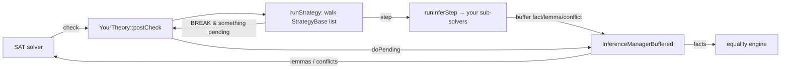

# The cvc5 Theory **Strategy Framework** — A Guide for Theory Authors

> How to give *any* theory solver an ordered, yield-aware inference strategy
> using the shared [`theory::StrategyBase`](src/theory/strategy.h) base class.
>
> This is the *general* companion to [docs-strings-strategy.md](docs-strings-strategy.md),
> which walks through the strings theory specifically. Read that one first if you
> want the concrete intuition; read this one when you want to add a strategy to a
> new theory (or understand the shared machinery).
>
> Audience: cvc5 contributors with a little SMT background.

---

## 1. What problem the framework solves

A theory solver in cvc5 reasons in **small steps** (check constants, check normal
forms, check memberships, …). The order of those steps matters, and after each
step the solver must decide whether to **keep reasoning internally** or **yield
control back to the SAT solver**. The bookkeeping for "an ordered list of steps,
sliced per effort level, with yield points between them" is identical across
theories — historically strings and bags each copy-pasted it.

`theory::StrategyBase<Step>` factors out exactly that shared bookkeeping. A
theory now supplies only:

1. its **own enum** of inference steps (including a `BREAK` marker),
2. a tiny derived `Strategy` class, and
3. the **recipe** (`initializeStrategy`) that lists the steps in order.

Everything else — storing the list, inserting `BREAK`s, recording per-effort
ranges, handing out iterators — is inherited.

```
        ┌──────────────────────────────────────────────────────────┐
        │  theory::StrategyBase<Step>   (src/theory/strategy.h)      │
        │  SHARED, REUSABLE                                          │
        │   • d_inferSteps : flat ordered list of (Step, effort)     │
        │   • BREAK markers inserted automatically                   │
        │   • per-effort [begin,end) ranges                          │
        │   • addStrategyStep / markStartEffort / markEndEffort /    │
        │     finishInit / stepBegin / stepEnd / hasStrategyEffort   │
        └───────────────▲───────────────────────▲──────────────────┘
                        │ derives                │ derives
        ┌───────────────┴────────────┐  ┌────────┴───────────────────┐
        │ strings::Strategy          │  │ bags::Strategy             │
        │  • enum InferStep + <<      │  │  • enum InferStep + <<     │
        │  • initializeStrategy()     │  │  • initializeStrategy()    │
        │  • (also EnvObj: uses opts) │  │  • (no options needed)     │
        └────────────────────────────┘  └────────────────────────────┘
```

The **execution** of the recipe (`runStrategy` / `runInferStep` / the `postCheck`
driver loop) stays in each theory, because those dispatch to theory-specific
sub-solvers and may apply theory-specific yield semantics. The framework owns the
*recipe*; the theory owns *how it is run*. This split is deliberate and keeps the
framework tiny and behavior-preserving.

---

## 2. Mental model (the same one as strings)

If you have not read [docs-strings-strategy.md](docs-strings-strategy.md), here is
the one-paragraph version. In CDCL(T), the SAT solver proposes a Boolean
assignment of the theory atoms and calls each theory's `check`/`postCheck`. The
theory walks its strategy. Each step may buffer one of three things:

| Output | Destination | Meaning |
|--------|-------------|---------|
| **fact** | the theory's own equality engine | a cheap consequence, absorbed internally (no SAT round-trip) |
| **lemma** | the SAT solver's output channel | a new clause / case split for the SAT solver to branch on |
| **conflict** | the SAT solver | "this assignment is impossible" → backtrack |

A `BREAK` marker between steps is a **yield point**: as soon as a step buffers
anything, the walk stops. The driver then flushes the buffer and decides whether
to loop again (only for cheap, fact-only progress) or return to the SAT solver
(on any lemma or conflict). This is what keeps a theory from getting *stuck*
internally while still letting it chain cheap deductions. The framework gives you
the `BREAK`-aware step list; you write the four-line driver loop that honors it.



---

## 3. The `StrategyBase<Step>` API

From [src/theory/strategy.h](src/theory/strategy.h). `Step` is *your* enum type.

### Public — used by your theory's driver/`postCheck`

| Member | Purpose |
|--------|---------|
| `StrategyBase(Step breakStep)` | Construct; tell the base which enum value is the `BREAK` marker. |
| `bool isStrategyInit() const` | Has `initializeStrategy()` finished? (assert in `postCheck`). |
| `bool hasStrategyEffort(Theory::Effort e) const` | Is there a step list for effort `e`? |
| `iterator stepBegin(Theory::Effort e)` | Begin of the step range for `e`. Yields `std::pair<Step,int>` (step, effort-arg). |
| `iterator stepEnd(Theory::Effort e)` | End of the range. **Points at the trailing `BREAK`**, which is therefore excluded from `[begin,end)` iteration (see note below). |
| `virtual void initializeStrategy() = 0` | **You implement this.** Builds the recipe. |

### Protected — used *inside* your `initializeStrategy()`

| Helper | Effect |
|--------|--------|
| `markStartEffort(Theory::Effort e)` | Record that effort `e`'s steps begin at the current end of the list. Call **before** adding the block. |
| `addStrategyStep(Step s, int effort = 0, bool addBreak = true)` | Append step `s` (with an integer `effort` arg passed through to `runInferStep`), plus a trailing `BREAK` by default. |
| `markEndEffort(Theory::Effort e)` | Record that effort `e`'s steps end here (at the trailing `BREAK`, index `size()-1`). Call **after** the block. |
| `finishInit()` | Compute the per-effort ranges and flag the strategy initialized. Call **once**, last. |

> **The `stepEnd` off-by-one is intentional and load-bearing.** `markEndEffort`
> stores `size()-1` (the index of the last step's trailing `BREAK`), and `stepEnd`
> returns an iterator to that `BREAK`. So `while (it != stepEnd)` runs every real
> step including the last, but never dereferences the final `BREAK`. This exactly
> reproduces the behavior of the original per-theory code; do not "fix" it.

> **`BREAK` is inserted automatically.** Never call `addStrategyStep(BREAK)`
> yourself — the base asserts `s != BREAK`.

---

## 4. Adding a strategy to a new theory — step by step

Say you are writing `theory::foo`. Five small pieces:

### Step 1 — define your step enum (in `theory/foo/strategy.h`)

```cpp
#include "theory/strategy.h"
#include "theory/theory.h"

namespace cvc5::internal {
namespace theory {
namespace foo {

enum class InferStep : uint32_t
{
  BREAK,            // REQUIRED: a dedicated yield marker
  CHECK_INIT,       // your steps, in any order you like
  CHECK_THING_A,
  CHECK_THING_B,
};
std::ostream& operator<<(std::ostream& out, InferStep i);  // for tracing
```

A plain `enum` works too (bags uses one). The only requirement is a `BREAK`
value.

### Step 2 — derive a thin `Strategy` (same header)

```cpp
class Strategy : public StrategyBase<InferStep>
{
 public:
  Strategy();
  ~Strategy();
  void initializeStrategy() override;
};
```

If your recipe needs solver **options**, also inherit `EnvObj` (like strings),
listing `StrategyBase` **first** so the constructor init order is unambiguous:

```cpp
class Strategy : public StrategyBase<InferStep>, protected EnvObj
{
 public:
  Strategy(Env& env);
  void initializeStrategy() override;
};
```

### Step 3 — implement the recipe (in `theory/foo/strategy.cpp`)

```cpp
Strategy::Strategy() : StrategyBase<InferStep>(InferStep::BREAK) {}
Strategy::~Strategy() {}

void Strategy::initializeStrategy()
{
  if (isStrategyInit()) return;

  markStartEffort(Theory::EFFORT_FULL);
  addStrategyStep(InferStep::CHECK_INIT);
  addStrategyStep(InferStep::CHECK_THING_A);
  addStrategyStep(InferStep::CHECK_THING_B);
  markEndEffort(Theory::EFFORT_FULL);

  // (optional) a second program for last-call effort:
  // markStartEffort(Theory::EFFORT_LAST_CALL);
  // addStrategyStep(InferStep::CHECK_THING_A, /*effort=*/3);
  // markEndEffort(Theory::EFFORT_LAST_CALL);

  finishInit();        // <-- always last
}
```

And the printer:

```cpp
std::ostream& operator<<(std::ostream& out, InferStep s)
{
  switch (s) { /* ... one case per value ... */ }
  return out;
}
```

### Step 4 — write the driver (in `theory/foo/theory_foo.cpp`)

The framework does **not** dictate this; copy the proven shape from strings/bags.
The two pieces:

**`runStrategy`** — walk the list, yield at `BREAK`:

```cpp
void TheoryFoo::runStrategy(Theory::Effort e)
{
  auto it      = d_strat.stepBegin(e);
  auto stepEnd = d_strat.stepEnd(e);
  while (it != stepEnd)
  {
    InferStep curr = it->first;
    int effort     = it->second;
    if (curr == InferStep::BREAK)
    {
      if (d_im.hasProcessed())   // hasProcessed() = inConflict || hasPending
      {
        break;                   // YIELD: something is ready to flush
      }
    }
    else
    {
      runInferStep(curr, effort);
      if (d_state.isInConflict())
      {
        break;
      }
    }
    ++it;
  }
}
```

**`runInferStep`** — dispatch a step to a sub-solver:

```cpp
void TheoryFoo::runInferStep(InferStep s, int effort)
{
  switch (s)
  {
    case InferStep::CHECK_INIT:    d_solver.checkInit();    break;
    case InferStep::CHECK_THING_A: d_solver.checkThingA();  break;
    case InferStep::CHECK_THING_B: d_solver.checkThingB();  break;
    default: Unreachable(); break;
  }
}
```

**The `postCheck` driver loop** — the anti-starvation engine (copy verbatim,
swapping the trace tags):

```cpp
void TheoryFoo::postCheck(Effort e)
{
  d_im.doPendingFacts();
  Assert(d_strat.isStrategyInit());
  if (!d_state.isInConflict() && !d_valuation.needCheck()
      && d_strat.hasStrategyEffort(e))
  {
    bool sentLemma = false, hadPending = false;
    do {
      d_im.reset();
      runStrategy(e);
      hadPending = d_im.hasPending();   // did a step buffer anything?
      d_im.doPending();                 // facts first, then lemmas
      sentLemma  = d_im.hasSentLemma();
    } while (!d_state.isInConflict() && !sentLemma && hadPending);
  }
  Assert(!d_im.hasPendingFact());
  Assert(!d_im.hasPendingLemma());
}
```

> The loop re-runs **only** while there was pending work *and* no lemma was sent
> *and* no conflict — i.e. only for cheap fact-only progress. Any lemma or
> conflict returns control to the SAT solver immediately. This is the rule that
> keeps the theory from monopolizing the solver; preserve it exactly.

Don't forget to call `d_strat.initializeStrategy()` once (theories do this in
`presolve()`), and to use an `InferenceManagerBuffered`-derived inference manager
so `d_im.hasPending()`, `doPending()`, `hasSentLemma()` exist.

### Step 5 — register files in the build

Add to `src/CMakeLists.txt`:

```
  theory/foo/strategy.cpp
  theory/foo/strategy.h
```

`theory/strategy.h` (the shared base) is already registered and header-only — no
`.cpp` to add.

---

## 5. Two real instantiations

### Bags — the minimal case ([theory/bags/strategy.cpp](src/theory/bags/strategy.cpp))

```cpp
Strategy::Strategy() : StrategyBase<InferStep>(BREAK) {}

void Strategy::initializeStrategy()
{
  if (isStrategyInit()) return;
  markStartEffort(Theory::EFFORT_FULL);
  addStrategyStep(CHECK_INIT);
  addStrategyStep(CHECK_BAG_MAKE);
  addStrategyStep(CHECK_BASIC_OPERATIONS);
  addStrategyStep(CHECK_QUANTIFIED_OPERATIONS);
  markEndEffort(Theory::EFFORT_FULL);
  finishInit();
}
```

Four steps, one effort, no options — the whole theory-specific recipe is ~10
lines. Bags' `Strategy` does not inherit `EnvObj` because it needs no options.

### Strings — the full-featured case ([theory/strings/strategy.cpp](src/theory/strings/strategy.cpp))

Strings inherits `EnvObj` (its recipe is option-dependent) and registers **two**
efforts — `EFFORT_FULL` and an optional `EFFORT_LAST_CALL` block guarded by
`stringModelBasedReduction`. It also uses the integer `effort` argument of
`addStrategyStep` (e.g. `CHECK_EXTF_EVAL` runs at effort 0, 1, and 3 at different
points). Same base class, same helpers — just a longer recipe. See the file for
the ~20-step list.

---

## 6. How the recipe is stored (worked trace)

For the bags recipe above, after `initializeStrategy()`:

```
d_inferSteps (index : value):
  0: CHECK_INIT                 1: BREAK
  2: CHECK_BAG_MAKE             3: BREAK
  4: CHECK_BASIC_OPERATIONS     5: BREAK
  6: CHECK_QUANTIFIED_OPERATIONS 7: BREAK

markStartEffort(FULL)  recorded begin = 0   (list was empty)
markEndEffort(FULL)    recorded end   = 7   (size()-1)
finishInit()           d_stratSteps[FULL] = (0, 7)

runStrategy(FULL): it goes 0,1,2,3,4,5,6  and stops at 7 (== stepEnd).
                   Index 7 (the final BREAK) is never visited.
```

If `CHECK_BAG_MAKE` (index 2) buffers a lemma, the `BREAK` at index 3 fires
(`hasProcessed()` is true), the walk stops, `postCheck` flushes the lemma, sees
`sentLemma`, and returns to the SAT solver — steps 4–6 are skipped this round.

---

## 7. Design rationale (for reviewers)

- **Why a template, not a `uint32_t`-based base?** Keeping `Step` as the theory's
  own enum means `stepBegin/stepEnd` yield `std::pair<Step,int>` directly, so the
  theory's `runStrategy` needs **no casts** and reads naturally
  (`curr == InferStep::BREAK`). It also made the strings migration *zero-change*
  in `theory_strings.cpp`.
- **Why keep `runStrategy`/`runInferStep`/`postCheck` per-theory?** They reference
  theory-specific sub-solvers and (subtly) differ in yield semantics — e.g. some
  bags steps short-circuit via a `bool` return, strings keys off
  `hasProcessed()`. Unifying them would risk behavior changes in the complex
  strings solver for no real sharing benefit. The framework's scope is the
  *recipe container* only.
- **Why `BREAK` is a constructor parameter.** Different theories number their
  enums differently (strings: `NONE=0, BREAK=1, …`; bags: `BREAK=0, …`). Passing
  the marker once avoids reserving a magic value and keeps each theory's enum
  free.
- **The `markStart/addStep/markEnd/finishInit` shape** mirrors the original local
  `step_begin`/`step_end` bookkeeping one-for-one, so the migration is a faithful
  mechanical transform with identical generated output.

---

## 8. Reviewer / author checklist

- [ ] Your enum has a `BREAK` value, passed to the `StrategyBase` constructor.
- [ ] `initializeStrategy()` is `override`, guards on `isStrategyInit()`, and ends
      with `finishInit()`.
- [ ] Every `markStartEffort(e)` has a matching `markEndEffort(e)` **before**
      `finishInit()`.
- [ ] You never call `addStrategyStep(BREAK)` by hand.
- [ ] If the recipe reads options, the class inherits `EnvObj` (listed *after*
      `StrategyBase` in the base list and the constructor init list).
- [ ] Your `runStrategy` honors `BREAK` as a yield point and breaks on conflict.
- [ ] Your `postCheck` loop re-runs **only** on fact-only progress
      (`!conflict && !sentLemma && hadPending`).
- [ ] `initializeStrategy()` is called once (typically in `presolve()`).
- [ ] `strategy.cpp`/`.h` added to `src/CMakeLists.txt`.
- [ ] `operator<<` covers every enum value (used by tracing; an
      `enum class … NONE..UNKNOWN` range may also be exercised by
      `test/unit/printer/print_enums.cpp`).

---

## 9. File map

| File | Role |
|------|------|
| [src/theory/strategy.h](src/theory/strategy.h) | **Shared** generic `StrategyBase<Step>` template (header-only). |
| [src/theory/strings/strategy.h](src/theory/strings/strategy.h) / [.cpp](src/theory/strings/strategy.cpp) | Strings enum + recipe (full-featured: options, two efforts). |
| [src/theory/bags/strategy.h](src/theory/bags/strategy.h) / [.cpp](src/theory/bags/strategy.cpp) | Bags enum + recipe (minimal: one effort, no options). |
| [src/theory/inference_manager_buffered.h](src/theory/inference_manager_buffered.h) | The buffered fact/lemma queues the driver flushes. |
| [docs-strings-strategy.md](docs-strings-strategy.md) | The strings-specific deep dive (concrete examples, CDCL(T) context). |
